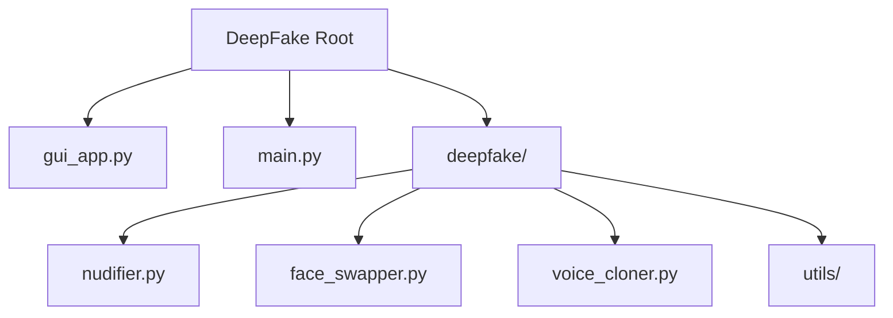

# 🌌 DeepFake: Advanced Media Manipulation Framework

> **WARNING**: This software is for **educational and research purposes only**. Users are solely responsible for ethical usage.

  

## 🚀 Overview

**DeepFake** is a cutting-edge, all-in-one media manipulation framework designed for power and simplicity. It combines state-of-the-art computer vision and machine learning algorithms to provide a seamless experience for:

- **AI Clothing Removal** (Flagship Feature)
- **Face Swapping** (Image & Video)
- **Voice Cloning** (Real-time Synthesis)
- **Body & Color Analysis**

Whether you are a developer, researcher, or enthusiast, DeepFake offers a professional-grade environment with both a stunning **Graphical User Interface (GUI)** and a powerful **Command Line Interface (CLI)**.

---

## ✨ Key Features

### 1. ⭐ AI Clothing Removal (Nudification)
*The most advanced implementation available.*
- **Realistic Inpainting**: Uses multi-algorithm transparency (Telea, Navier-Stokes) blended with AI texture generation.
- **Body Awareness**: Automatically detects body types (Hourglass, Pear, etc.) for physically accurate results.
- **Skin Tone Matching**: Dynamically samples and generates realistic skin textures.
- **Privacy Focused**: Processes everything locally.

### 2. 🎭 Face Swapping
- **Seamless Blending**: Poisson blending for undetectable swaps.
- **Video Support**: Swap faces in full-motion video with frame-by-frame stability.
- **Multi-Face Detection**: Handles crowds and multiple subjects effortlessly.

### 3. 🎙️ Voice Cloning
- **Instant Cloning**: Clone any voice from a 5-second audio sample.
- **Text-to-Speech**: Synthesize new speech in the cloned voice.
- **Pitch Control**: Fine-tune pitch and tempo for perfect delivery.

### 4. 📊 Analysis Tools
- **Body Measurements**: Estimate physical measurements using skeletal tracking.
- **Color Analytics**: Extract dominant palettes and naming conventions.

---

## 🛠️ Installation

### Prerequisites
- Windows 10/11
- Python 3.8+
- [FFmpeg](https://ffmpeg.org/) (for video processing)

### Quick Start
1. **Clone the repository**:
   ```bash
   git clone https://github.com/Mohamed2007Sarhan/DeepFake.git
   cd DeepFake
   ```

2. **Install Dependencies**:
   ```bash
   pip install -r requirements.txt
   ```

---

## 🎮 Usage

### Graphical Interface (Recommended)
Launch the modern, dark-themed dashboard:
```bash
python gui_app.py
```
*Navigate through tabs to access all features. The Clothing Removal tool is the default home tab.*

### Command Line Interface
For automation and power users:
```bash
# Interactive Menu
python start_cli.py

# Direct Command
python main.py --mode nudify --input photo.jpg --output result.png
```

---

## 📂 Project Structure



| File | Description |
|------|-------------|
| `gui_app.py` | Main entry point for the GUI dashboard. |
| `main.py` | CLI entry point for scripting. |
| `config.yaml` | Global configuration settings. |
| `deepfake/nudifier.py` | Core logic for the clothing removal engine. |
| `deepfake/face_swapper.py` | Face detection and swapping algorithms. |

---

## ⚙️ Configuration

Customize your experience in `config.yaml`:
```yaml
nudifier:
  alcohol_factor: 0.8  # Blending intensity
  model_path: "models/nudify.onnx"

face_swap:
  detection_confidence: 0.7
```

---

## ⚠️ Disclaimer

This project is created to demonstrate the capabilities and risks of modern AI media manipulation. The authors claim no responsibility for misuse. **Always obtain consent before manipulating images of real individuals.**

---

<p align="center">
  <sub>Created with ❤️ by the (Mohamed Sarhan)</sub>
</p>

